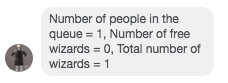

# Personal Stylist Tutorial on Using Personal Style Bot:

1. **Find the bot:**

Go to: https://www.facebook.com/personalstylebot/

2. **Signing into the bot:**

Send pin “1234” to bot
You will receive the following options

	
3. **Select “Give style advice”:**

Great! Now you are a registered personal stylist. If you receive a message from a user you will have the opportunity to claim or reject the conversation. 
	
4. **Select Claim, to begin the conversation:**

You will receive the following options

5. **Ending a conversation: If the user:**

* Hasn’t been responding for 20 minutes OR
* Responds only every 10 minutes
* There are a lot of users in the queue (See general advice section)

Then ask them “Is there anything else I can help you with?” If no response in 5-10 minutes, then tell them to check back in another time and sign off. Send the pin “1234” to the bot again

And select "End conversation". The conversation will be ended and logged. 

6. **Logging off as a stylist**:

Type "1234":

And select "Stop giving advice". The conversation will be ended and logged and you will be removed as a stylist until you sign on again. 

# General advice for conversation(s)

## Lots of people in the queue? 

The updates on the numbers of users in the queue are meant to help you see how many users are online. If there is more than 1 person waiting and you are the only stylist online, try to wrap up your conversation somewhat quickly so you can help someone else. 

## Solicit better responses from your user by asking them background questions like:

* Where are you going?
* Are you in school?
* What kinds of events do you typically attend?
* What is your workplace dress code?
* What is the weather going to be like?
* What kinds of dresses do you typically like best? 
* What colors do you generally prefer?

## Use background information to offer general ideas like:

* These shoes would go well with a dress for a concert
* Here are some floral patterns that work well with the color yellow
* Here are some dresses that are good for an autumn wedding

## Send images to give users a better idea of what they are looking for...

